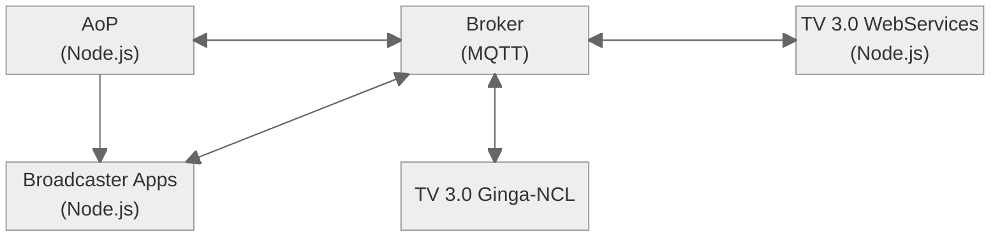

# Ginga Distributed Framework

    

The **Ginga Distributed Framework (GDF)** project provides an evironment for testing and demonstration of new Ginga features. It encompasses all the components to simmulate a TV 3.0 receiver.


# Features

* Distributed implementation of TV 3.0 components in a microservices fashion
   * App based DTV+ interface
   * Broadcaster apps with video streaming
   * WebServices APIs
   * Ginga NCL Scheduler
* MQTT-based
   * Application state stored in broker topics
   * Topic viewer allows one to keep track of the app state
   * Remote device simulator allows one to keep track of exchanged messages


# Architecture



# Dependencies

* Mosquitto MQTT Broker
* Lua
* Node JS
* [PM2](https://pm2.keymetrics.io)
* [NW.js](https://nwjs.io)
* [FFmpeg](https://ffmpeg.org)


# Execution

Components managed by PM2.
```$ pm2 start ecosystem.config.js```