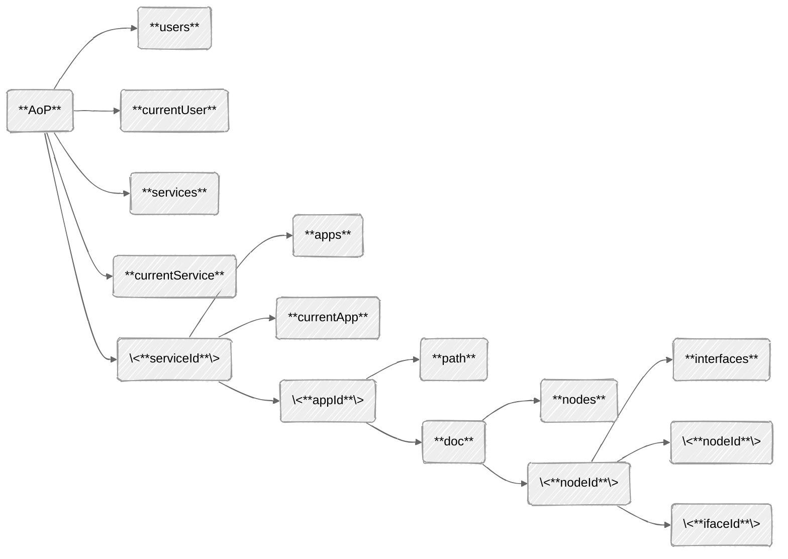
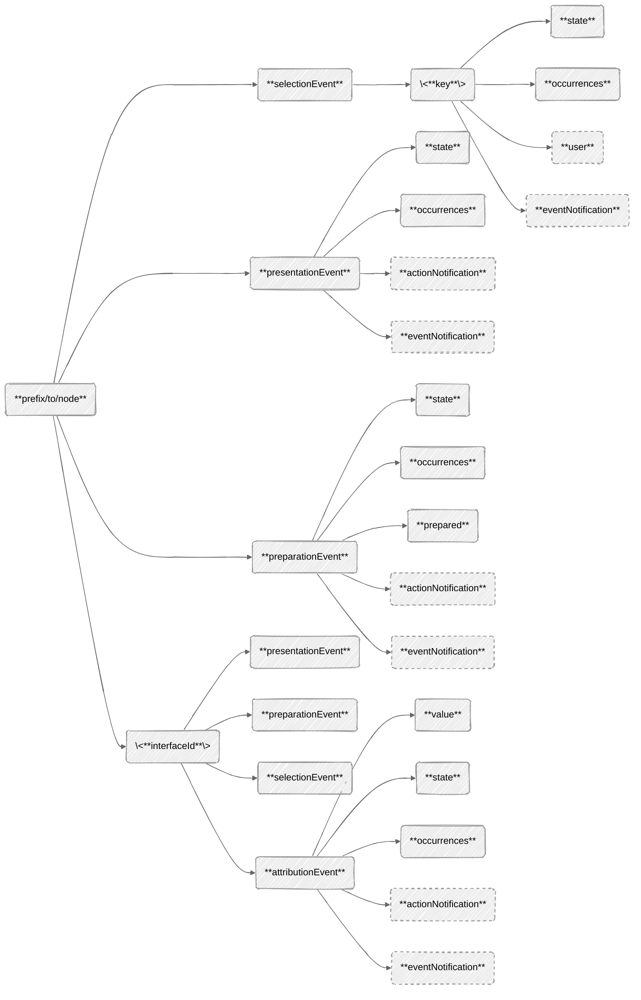

# Broker Documentation

## Topic structure

The table below present the topics together with its associated QoS and retain parameters, topic format, and description. In the table, subtopics marked as `<subtopic>` represent parameterized parts of a topic.

| Topic                                 | QoS | Retained | Format  | Description                                |
|---------------------------------------|-----|----------|---------|--------------------------------------------|
| `aop/users`                           | 1   | True     | URL     | Path to user data file and thumbs          |
| `aop/currentUser`                     | 1   | True     | UUID    | User currently selected                    |
| `aop/services`                        | 1   | True     | JSON    | JSON vector of services information        |
| `aop/currentService`                  | 1   | True     | Integer | Service currently in use                   |
| `aop/<serviceId>/apps`                | 1   | True     | JSON    | JSON vector of applications information    |
| `aop/<serviceId>/currentApp`          | 1   | True     | Integer | Application in execution                   |
| `aop/<serviceId>/<appId>/path`        | 1   | True     | URL     | Path to application data                   |
| `aop/<serviceId>/<appId>/doc/nodes`   | 1   | True     | JSON    | JSON vector of document node data          |

When constructing the topic, parameter `<serviceId>` holds the current service id, while `<appId>` holds the current application id.
The diagram below presents the topic structure in a tree structure. In the diagram solid nodes represent retained topics and dashed node the ones not retained.

The prefix `aop/<serviceId>/<appId>/doc` regards topics that present information about an application node. They shall indicate the document structure regarding node identifires. For example, topic `aop/<serviceId>/<appId>/doc/nid1/nid2/nid3` access information about node with id *nid3* that is a child node of *nid2* that is a child node of node *nid1*. The same way, topic `aop/<serviceId>/<appId>/doc/nid1/iid1` access information about interface *iid1*, child of node *nid1*. Node structure is available in topic `aop/<serviceId>/<appId>/doc/nodes` as seen in the table above, while interface information is provided together within a node set of topics as presented in the table below. One should notice that, in the table, each topic considers a prefix to take to that node as discussed above.

| Topic                                                             | QoS | Retained | Format  | Description                                |
|-------------------------------------------------------------------|-----|----------|---------|--------------------------------------------|
| `/<nodeId>/interfaces`                                            | 1   | True     | JSON    | JSON vector of node interfaces             |
| `/<nodeId>/(presentation\|preparation)Event/state`                | 1   | True     | String  | NCL event statemachine state               |
| `/<nodeId>/(presentation\|preparation)Event/occurrences`          | 1   | True     | Integer | Number of occurrences                      |
| `/<nodeId>/(presentation\|preparation)Event/actionNotification`   | 1   | False    | String  | NCL action to be performed in the event    |
| `/<nodeId>/(presentation\|preparation)Event/eventNotification`    | 1   | False    | String  | NCL transition to be notified              |
| `/<nodeId>/preparationEvent/prepared`                             | 1   | True     | Boolean | Indicate that preparation was succesful    |
| `/<nodeId>/selectionEvent/<key>/user`                             | 1   | False    | String  | User that performed the interaction        |
| `/<nodeId>/selectionEvent/<key>/state`                            | 1   | True     | String  | NCL event statemachine state               |
| `/<nodeId>/selectionEvent/<key>/occurrences`                      | 1   | True     | Integer | Number of occurrences                      |
| `/<nodeId>/selectionEvent/<key>/actionNotification`               | 1   | False    | String  | NCL action to be performed in the event    |
| `/<nodeId>/selectionEvent/<key>/eventNotification`                | 1   | False    | String  | NCL transition to be notified              |
| `/<ifaceId>/attributionEvent/value`                               | 1   | True     | String  | Value of a property-type interface         |
| `/<ifaceId>/attributionEvent/state`                               | 1   | True     | String  | NCL event statemachine state               |
| `/<ifaceId>/attributionEvent/occurrences`                         | 1   | True     | Integer | Number of occurrences                      |
| `/<ifaceId>/attributionEvent/actionNotification`                  | 1   | False    | String  | NCL action to be performed in the event    |
| `/<ifaceId>/attributionEvent/eventNotification`                   | 1   | False    | String  | NCL transition to be notified              |

When constructing the topic, parameter `<nodeId>` holds a node id, while `<ifaceId>` holds an interface id. The above topics access information of the supported events: *presentationEvent*, *preparationEvent*, *attributionEvent*, and *selectionEvent*. One should notice that all have the suffix *-Event*. Other events shall follow the same structure. In the case of selection events, parameter `<key>` has also to be defined.

The diagram below presents the topic structure in a tree structure. In the diagram solid nodes represent retained topics and dashed node the ones not retained.

### Service Information Metadata

The JSON vector of objects representing service information presents the attributes described in the table below.

| Attribute         | Format  | Description                                                  |
|-------------------|---------|--------------------------------------------------------------|
| `serviceId`       | Integer | Identifies the corresponding DTV service                     |
| `serviceName`     | String  | DTV service name                                             |
| `serviceIcon`     | SVG     | DTV service logo in svg                                      |
| `initialMediaURL` | URL     | Linear service URL to be used in the bootstrap application   |

### Application Information Metadata

The JSON vector of objects representing application information presents the attributes described in the table below.

| Attribute     | Format  | Description                                                             |
|---------------|---------|-------------------------------------------------------------------------|
| `appId`       | Integer | Identifies the corresponding application                                |
| `appName`     | String  | Human-readable name for the application                                 |
| `appType`     | String  | Application type: *TV30-Ginga-HTML5* or *TV30-Ginga-NCL*                |
| `controlCode` | String  | Specifies the dynamic control of application life cycle                 |
| `state`       | String  | Application state: *running*, *stored*, *unloaded*, *loading*, *loaded* |
| `entryPoint`  | URL     | Application's path                                                      |

### Node data structure

The table below present the attributes of the JSON object that store node data.

| Attribute     | Format  | Description                                           |
|---------------|---------|-------------------------------------------------------|
| `id`          | ID      | The node unique identifier in the document            |
| `type`        | String  | Type of the NCL node: *media*, *context*, or *switch* |
| `mimeType`    | MIME    | MIME Type according to IANA for media type node       |
| `device`      | String  | An optional device where to render the node           |

### Interface data structure

The table below present the attributes of the JSON object that store node interface data.

| Attribute     | Format  | Description                                                   |
|---------------|---------|---------------------------------------------------------------|
| `id`          | ID      | The interface unique identifier in the document               |
| `type`        | String  | Type of the NCL node interface: *area*, *property*, or *port* |
